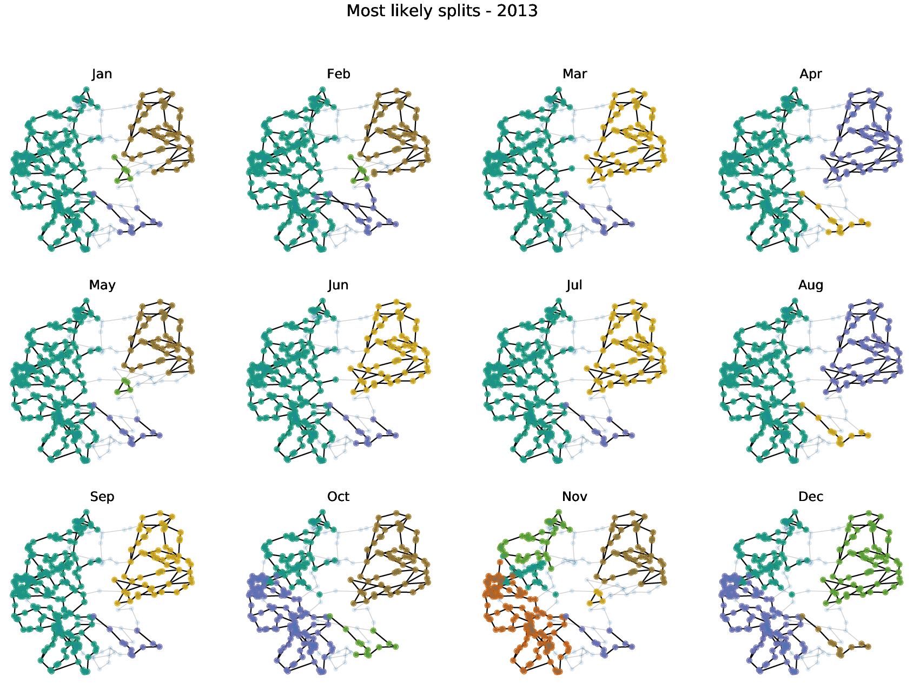

# Power System Split

## Installation

All the requirements can be found in `requirements.txt` and the package can be installed using `pip install -r requirements.txt`. Tested for python 3.7.

To get the code running, copy the German data into a folder `power_system_split/data/Germany/`. The European data should lie under `power_system_split/data/European_networks/`.

## Usage

The following image displaces the nodes that remain connected after a large system split
with 99 % probability:

